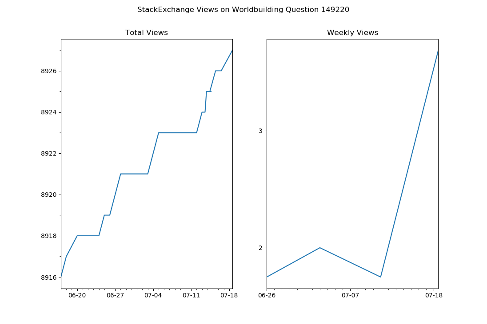

I wrote a simple python script which I run every day to keep track of the views across all of my Questions and Answes on the StackExchange Network.




It uses the StackAPI which you can install with: `pip3 install StackAPI`


To run it, you need the `site_name` from the url and you `user_id` there.

For example on the Arquade Stack Exchange the url is actually called gaming.stackexchange

The best way to find this info is to click your user page (for that site)

For example I would click: https://gaming.stackexchange.com/users/234411/surprisedog

and I would copy paste the values to run the script like this:

````
./se.views.py gaming 234411

````

You can also run it on multiple sites at once like this:

````
./se.views.py askubuntu 951756 superuser 1023751 worldbuilding 63172

````

----

## Graphing

After you have built up several weeks of data on StackExchange views, you can graph it by running:

./se.plot.py se.views.out <url>


For example to get the number of views on my popular Lifehacks question I would run:

```
./se.plot.py se.views.out https://lifehacks.stackexchange.com/questions/22791/how-can-i
```
