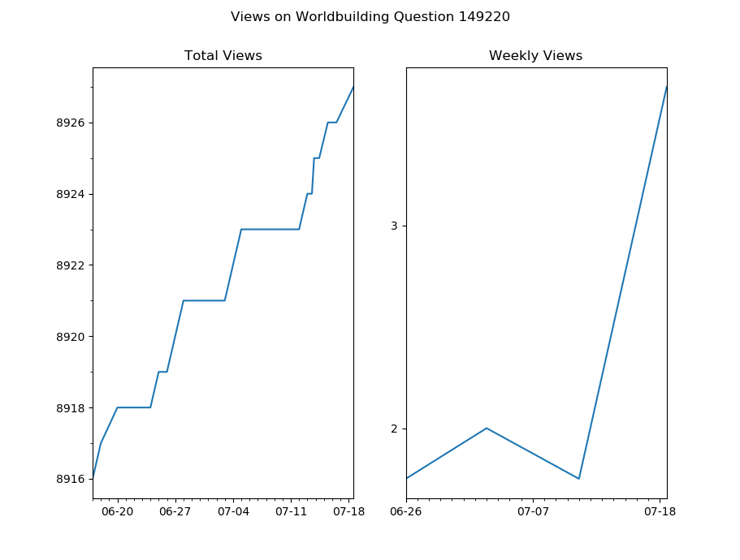

I wrote a simple python script which I run everyday to keep track of the views thread where I contributed a Question or Answer and make neat graphs show views per week.




It uses the StackAPI which you can install with: `pip3 install StackAPI`


To run it, you need the `site_name` from the url and you `user_id` there. For example Arquade Stack Exchange is actually called gaming.stackexchange in the url. The best way is to click your user page there to get both. For example I would click: https://gaming.stackexchange.com/users/234411/surprisedog

and I would run the script like this:

````
./se.views.py gaming 234411

````

You can also run it on multiple sites at once like this:

````
./se.views.py askubuntu 951756 superuser 1023751 worldbuilding 63172

````

----

##Graphing

After you have built up several weeks of data on StackExchange views, you can graph it by running:

./se.plot.py se.views.out <url>


For example to get the number of views on my popular Lifehacks question I would run:

```
./se.plot.py se.views.out https://lifehacks.stackexchange.com/questions/22791/how-can-i
```
